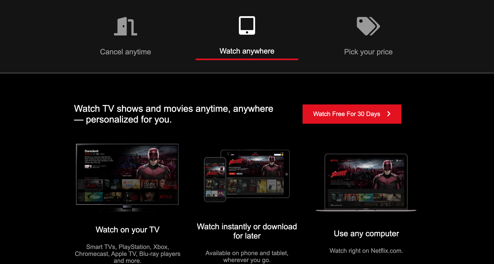

# Netflix Clone

Made a Netflix clone website to practice CSS components (grid, flexbox, positioning, table, hide/show, z-index, box-shadow inset etc...) and mobile responsiveness.

# Demo

# Technologies Used

HTML,
Plain CSS,
Vanilla JS

# Problems

Clicking on the tabs to show the appropriate content and hide the previous ones was kinda problematic whilst I am still a beginner in JS.

# Website

https://buigabor.github.io/Netflix-Clone/
